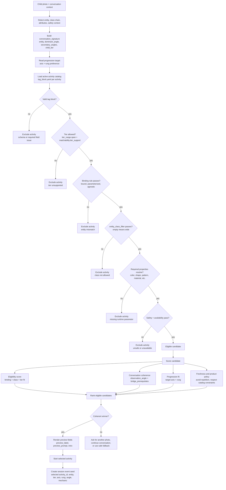
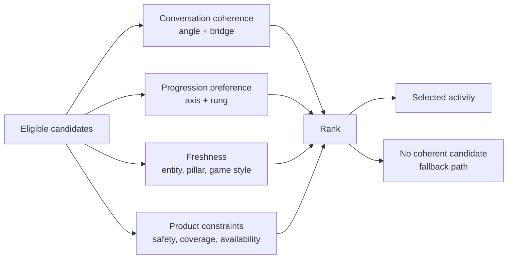
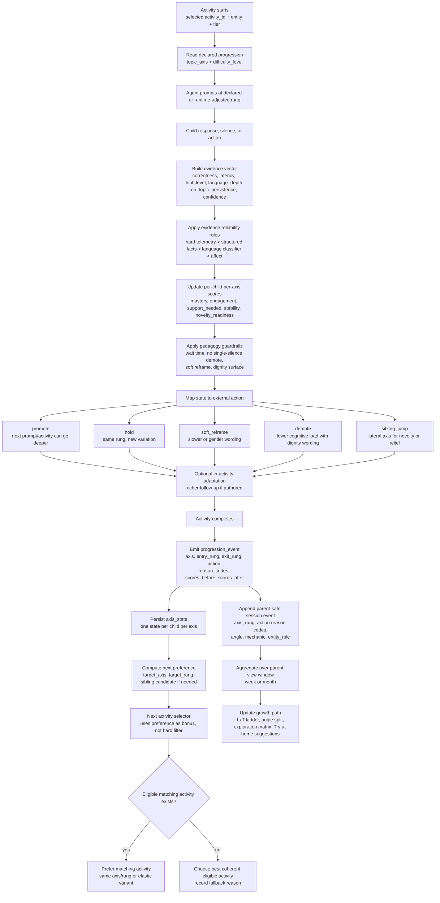
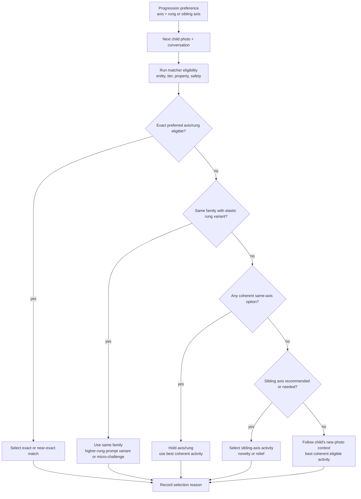
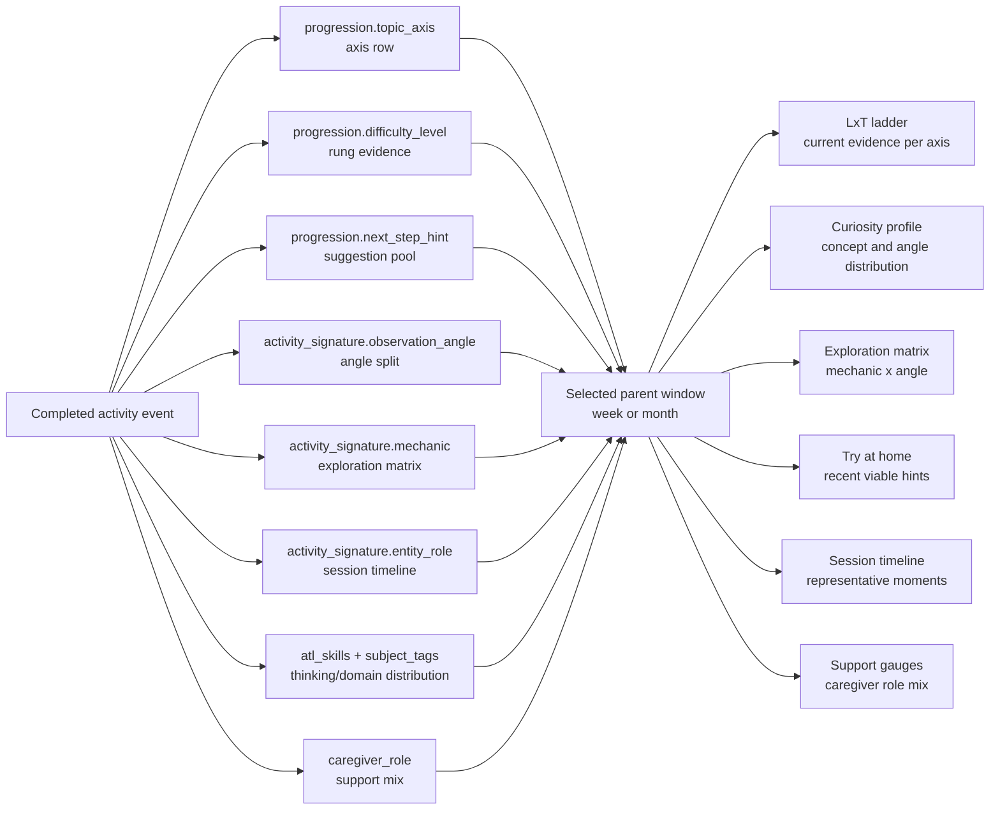

# Activity Matcher and Progression Workflows

**Version:** 0.1 - 2026-04-30
**Status:** Supplement reference
**Chinese version:** `docs/activity_matcher_progression_workflows_cn.md`
**Related guide:** `docs/activity_tag_block_progression_guide.md`

This document is diagram-first. It shows how the matcher uses the full tag block before an activity starts, and how the progression algorithm updates the next activity recommendation and parent growth path after an activity completes.

---

## 1. Activity Matcher Workflow

The matcher has two gates:

1. **Eligibility:** can this activity run for this photo, tier, and runtime context?
2. **Ranking:** among eligible activities, which one best follows the conversation and progression target?

### 1.1 Eligibility Rules

An activity enters the candidate set only when all hard checks pass:

| Check | Fields used | Failure behavior |
|---|---|---|
| Tag block validity | schema-required fields | Exclude from catalog. |
| Tier support | `tier_range.span`, `matchability.tier_support` | Exclude for this child tier. |
| Binding fit | `entity_binding`, `entity`, `entity_class` | Exclude if the photo cannot support the declared binding. |
| Handoff compatibility | `entity_compatibility`, `parameterization.mode` when available | Exclude or flag if the package is source-bound, unsupported, or missing the mode required for arbitrary handoff. |
| Class allowlist | `matchability.entity_class_filter` | Exclude if non-empty filter does not intersect the detected entity class chain. |
| Property resolution | `activity_signature.focal_attribute`, legacy `entity_attributes_covered` where present | Exclude if required runtime value cannot be filled. |
| Safety/runtime availability | runtime safety and environment checks | Exclude or ask for another photo. |

### 1.2 Binding Examples

| Binding | Eligible example | Common `entity_class_filter` |
|---|---|---|
| `bound` | `voice_stage_lion` for lion/big-cat contexts. | Narrow: `[big_cat]`, `[butterfly]`, `[ladybug]`. |
| `parameterized` | `color_scout_property` for any safe entity with a resolvable color. | Wide `[]` for universal property hunts; restricted `[patterned_thing]` for pattern-specific activities. |
| `agnostic` | General noticing warm-up where the photo only anchors attention. | Usually `[]` or `[observable_thing]`. |

### 1.3 Ranking Is Separate From Eligibility

Eligibility says the activity may run. Ranking chooses the best activity among eligible candidates.

---

## 2. Progression Workflow

Progression starts with the activity's declared axis/rung, but it updates state from observed child evidence. It affects the next activity as a recommendation, not a guarantee.

### 2.1 What Changes During The Activity

During the live activity, the runtime may adapt the prompt, hint, wait time, multiple-choice support, or wording. It should not suddenly swap the whole activity.

| Runtime signal | Allowed live effect |
|---|---|
| Long wait but engaged | `soft_reframe`, longer wait, gentler prompt. |
| Correct after support | Usually `hold`; vary exemplar or ask a similar prompt. |
| Spontaneous deeper answer | Optional richer follow-up if the activity has an authored variant. |
| Repeated overload | Lower cognitive load with dignity wording. |

### 2.2 What Changes After The Activity

Durable progression state normally commits after the activity ends.

| Output | Consumer | Use |
|---|---|---|
| `axis_state` | Progression engine and selector | Tracks current rung, mastery, engagement, support need, stability, novelty readiness. |
| `progression_event` | Analytics/debugging/parent-safe rollup | Explains why the action happened without exposing raw transcript. |
| `target_axis` / `target_rung` | Next activity selector | Adds a preference bonus to the next selection. |
| parent-safe session event | Parent dashboard | Feeds weekly/monthly aggregate views. |

### 2.3 Next Activity Routing

Progression preference is not a reservation. The next activity must still pass matcher eligibility and make sense for the child's actual next photo.

### 2.4 Parent Growth Path Impact

Parent-facing growth path is a windowed aggregate of completed activity events.

One activity adds one event. It should not overwrite the growth path. If the next photo leads to a different axis, the parent dashboard should show both paths in the selected window.

---

## 3. Source Map

| Need | Source |
|---|---|
| Full field reference | `docs/activity_tag_block_progression_guide.md` |
| Activity-signature fields and scoring | `docs/plans/2026-04-23-activity-signature-design.md` |
| Progression algorithm | `docs/superpowers/specs/2026-04-24-progression-algorithm-design.md` |
| Progression axis contract | `docs/progression_axes.md` |
| Parent dashboard read contract | `docs/parent_growth_path_preview.html` |
