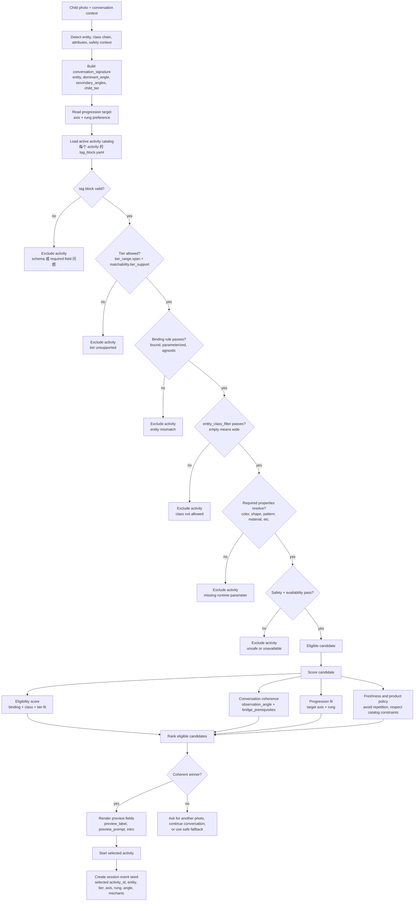
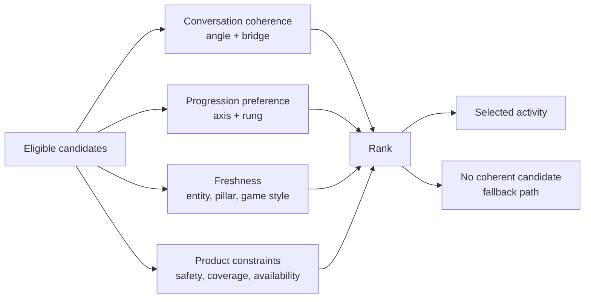
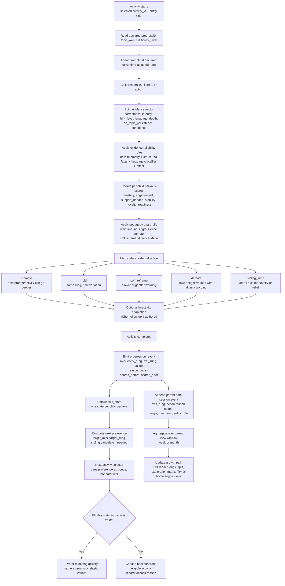
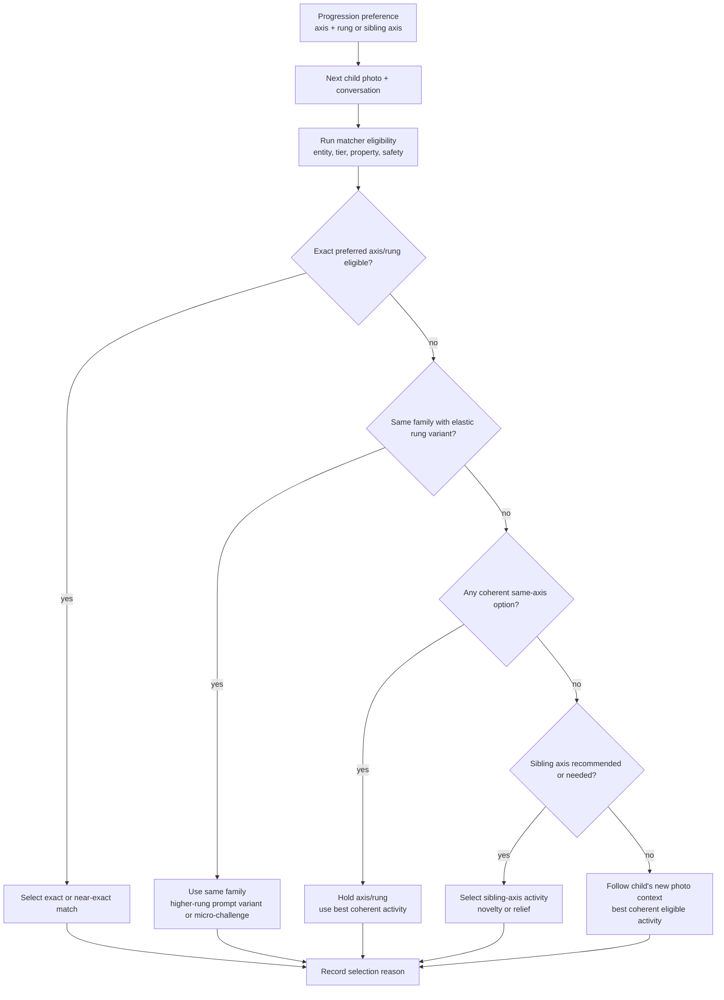
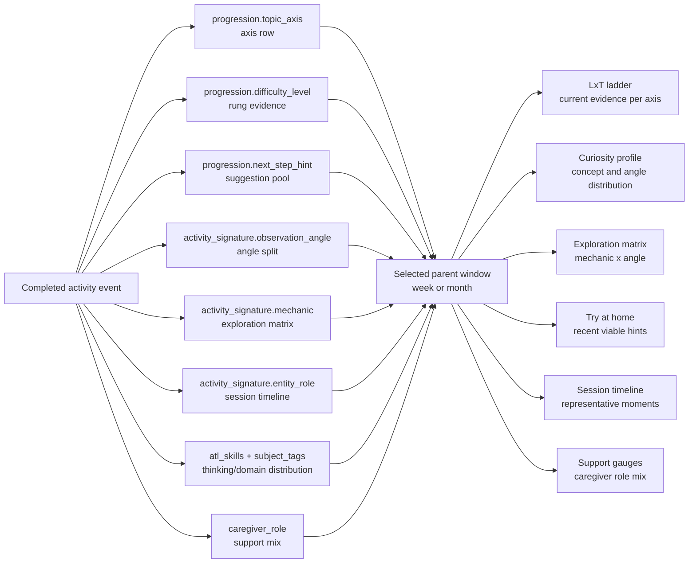

# Activity Matcher 与 Progression Workflows

**Version:** 0.1 - 2026-04-30
**Status:** Supplement reference
**English version:** `docs/activity_matcher_progression_workflows.md`
**Related guide:** `docs/activity_tag_block_progression_guide_cn.md`

这份文档用 diagram 说明两条 runtime workflow：

1. activity matcher 如何从照片和 conversation 进入 tag block，筛出 eligible candidates，再排序选出 activity。
2. progression algorithm 如何在 activity 结束后更新 next activity recommendation，并把 parent-safe event 汇入 parent growth path。

技术字段、enum、runtime action、模块名保留 English。

---

## 1. Activity Matcher Workflow

matcher 有两层：

1. **Eligibility:** 这个 activity 能不能用于当前 photo、tier、runtime context?
2. **Ranking:** 在 eligible activities 里，哪一个最适合延续 conversation 和 progression target?

### 1.1 Eligibility Rules

activity 只有通过所有 hard checks，才会进入 candidate set：

| Check | Fields used | Failure behavior |
|---|---|---|
| Tag block validity | schema-required fields | 从 catalog 中排除。 |
| Tier support | `tier_range.span`, `matchability.tier_support` | 当前 child tier 不支持时排除。 |
| Binding fit | `entity_binding`, `entity`, `entity_class` | 当前 photo 无法支持声明的 binding 时排除。 |
| Class allowlist | `matchability.entity_class_filter` | 非空 filter 和 detected class chain 没交集时排除。 |
| Property resolution | `activity_signature.focal_attribute`, legacy `entity_attributes_covered` where present | 必要 runtime value 无法填充时排除。 |
| Safety/runtime availability | runtime safety and environment checks | 排除，或要求重新拍照。 |

### 1.2 Binding Examples

| Binding | Eligible example | Common `entity_class_filter` |
|---|---|---|
| `bound` | `voice_stage_lion` 用于 lion / big-cat context。 | 窄范围：`[big_cat]`, `[butterfly]`, `[ladybug]`。 |
| `parameterized` | `color_scout_property` 用于任何安全且能解析 color 的 entity。 | universal property hunt 用 `[]`；pattern-specific activity 用 `[patterned_thing]`。 |
| `agnostic` | photo 只作为注意力锚点的 general noticing warm-up。 | 通常 `[]` 或 `[observable_thing]`。 |

### 1.3 Ranking 和 Eligibility 分开

eligibility 只说明 activity 可以运行。ranking 才是在 eligible candidates 中选择最好的一个。

---

## 2. Progression Workflow

progression 从 activity 声明的 axis/rung 开始，但真正更新 state 的依据是孩子在 session 中的表现。它影响下一次 activity selection，但只是 recommendation，不是 reservation。

### 2.1 Activity 进行中可以改变什么

live activity 中，runtime 可以调整 prompt、hint、wait time、multiple-choice support 或 wording，但不应该突然替换整个 activity。

| Runtime signal | Allowed live effect |
|---|---|
| Long wait but engaged | `soft_reframe`，延长 wait，换更温和的 prompt。 |
| Correct after support | 通常 `hold`，换 exemplar 或类似 prompt。 |
| Spontaneous deeper answer | 如果 activity 有 authored variant，可以问一个 richer follow-up。 |
| Repeated overload | 降低 cognitive load，并用 dignity wording。 |

### 2.2 Activity 结束后会改变什么

durable progression state 通常在 activity 结束后 commit。

| Output | Consumer | Use |
|---|---|---|
| `axis_state` | Progression engine and selector | 记录 current rung、mastery、engagement、support need、stability、novelty readiness。 |
| `progression_event` | Analytics/debugging/parent-safe rollup | 解释 action 为什么发生，不暴露 raw transcript。 |
| `target_axis` / `target_rung` | Next activity selector | 给下一次 selection 加 preference bonus。 |
| parent-safe session event | Parent dashboard | 汇入 weekly/monthly aggregate views。 |

### 2.3 Next Activity Routing

progression preference 不是 reservation。下一次 activity 仍然必须通过 matcher eligibility，并且要符合孩子真实拍下来的下一张照片。

### 2.4 Parent Growth Path Impact

parent-facing growth path 是 completed activity events 的 windowed aggregate。

一个 activity 只添加一个 event，不应该覆盖整个 growth path。如果下一张照片把孩子带到另一条 axis，parent dashboard 应该在当前 window 里同时保留两条路径的 evidence。

---

## 3. Source Map

| Need | Source |
|---|---|
| Full field reference | `docs/activity_tag_block_progression_guide.md` / `docs/activity_tag_block_progression_guide_cn.md` |
| Activity-signature fields and scoring | `docs/plans/2026-04-23-activity-signature-design.md` |
| Progression algorithm | `docs/superpowers/specs/2026-04-24-progression-algorithm-design.md` |
| Progression axis contract | `docs/progression_axes.md` |
| Parent dashboard read contract | `docs/parent_growth_path_preview.html` |
