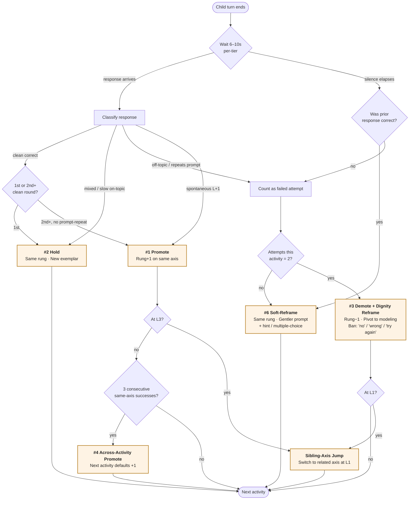
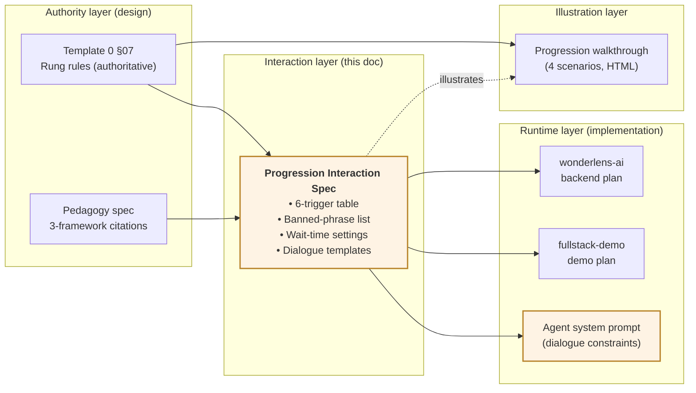

# Progression Interaction Spec — Dialogue-Layer Rules for the Rung Engine

**Date:** 2026-04-23
**Status:** Draft, pending review
**Template 0 authority:** `docs/template_0_preview.html` §07 (rules unchanged)
**Runtime authority:** [2026-04-21-progression-runtime-integration.md](./2026-04-21-progression-runtime-integration.md) (5-trigger table — this doc adds a 6th)
**Source pedagogy:** `progression-pedagogy-spec.md` (three-framework ECE synthesis: Colorado ELDG · UK EYFS Development Matters · China MoE 3–6 Guidelines)

---

## 1 · Context

The rung engine (`§07` + runtime integration doc) specifies **what** the state machine does on each turn — promote / hold / demote / sibling-jump. It does **not** specify:

1. **How the agent speaks** during those transitions (what phrases are banned, what implicit-correction patterns replace them).
2. **How long the agent waits** before treating silence as a signal (universal 6–10s processing time vs. default 2s VAD).
3. **The Soft-Reframe move** as a first-class runtime trigger — it exists in the walkthrough (Scenario 4) as a "beat-level adjustment" but is absent from the 5-trigger table.

These three gaps all live at the **dialogue/agent layer** — the bridge between the state machine and the live conversational agent. The ECE pedagogy spec cites all three as non-negotiable across Colorado, EYFS, and the Chinese MoE frameworks. This plan adds that layer without touching §07 or the runtime plan.

### 1.1 Why now

- The runtime integration plan is mid-implementation in `wonderlens-ai` + `fullstack-demo`. The 6th trigger (Soft-Reframe) needs to land with the other five, not be retrofitted.
- The agent-prompt layer has no canonical constraint doc yet. Without one, each downstream surface will re-invent dialogue rules and drift.
- The pedagogy spec provides the three-framework citations; locking them into one doc now means every future agent prompt can reference them.

---

## 2 · Scope

### In scope

- **One new doc:** this file, establishing the dialogue-layer contract
- **Addendum to the 5-trigger table** — adds Soft-Reframe as trigger #6
- **Banned-phrase list + implicit-correction patterns** for the Dignity Reframe
- **Universal wait-time setting** (6–10s processing window, per-tier tuning)
- **Agent-system-prompt injection points** — where these rules feed into the live agent prompt
- **Two diagrams** — mid-activity decision flow + doc-layering
- **Cross-links** from Template 0 §07 footer and the runtime integration doc

### Out of scope

- **Runtime-code changes** — those live in `wonderlens-ai` / `fullstack-demo` plans. This doc is upstream design only.
- **LLM-based response classifier** — still deferred (see runtime plan §6 limitation 1). This spec assumes the classifier exists and emits `{correct, mixed, silence_after_correct, silence_as_attempt, off_topic, repeat_prompt, spontaneous_l_plus_1}`.
- **Per-child pace model** — still deferred; v1 keeps universal wait-time thresholds.
- **Translating pedagogy citations into CN** — the framework citations stay in their source languages (Colorado EN, EYFS EN, MoE CN). Not a bilingual artifact.
- **Template 0 §07 rewrites** — only a 2-line footer cross-link added.

---

## 3 · The six triggers (5 existing + Soft-Reframe)

Extends the runtime integration doc §2 table. **Rows 1–5 are unchanged.** Row 6 is new.

| # | Trigger | Scope | Condition | Effect | Dialogue pattern |
|---|---|---|---|---|---|
| 1 | **Within-activity promote** | single activity | 2+ rounds correct w/o prompt-repeat, OR spontaneous L+1 | bump rung for next activity on axis | Celebration + invitation: *"You noticed [specific thing]. What else?"* |
| 2 | **Within-activity hold** | single activity | mixed / slow but on-topic, OR 1 clean correct round | stay at rung, vary exemplar | Sustaining: *"Yes — and look at this one. What do you notice?"* |
| 3 | **Within-activity demote** | single activity | 2 attempts (silence>6s, off-topic, or repeats prompt) | drop one rung, same axis, floor L1 | **Dignity Reframe** (see §5) |
| 4 | **Across-activity promote** | session sequence | 3 consecutive same-axis successes | next activity defaults +1 | Same as #1 |
| 5 | **Across-activity demote** | session sequence | 2 consecutive in-activity demotes on axis | next activity defaults −1 (floor L1); if already at L1, sibling-axis jump | **Dignity Reframe** + lateral pivot |
| 6 | **Soft-Reframe** *(new)* | within-turn | silence 6–10s **after a correct response**, OR mixed/slow on-topic with hesitation | **no rung change**; gentler prompt, scaffolding (hint, multiple-choice), extended wait | *Gentle nudge*: *"Take your time. I'm wondering about [thing] — what do you think?"* |

**Critical distinction between #3 and #6:** silence alone is not a demote. A demote requires 2 failed *attempts* (silence + off-topic + repeat-prompt in some combination). A single silence *after a correct answer* is processing time, not failure — trigger #6 fires, not #3. This is exactly the "reluctance, not inability" case the walkthrough Scenario 4 illustrates; this spec formalizes it as a runtime trigger.

### 3.1 Pedagogical citations

Every row above is backed by at least one citation from each of the three frameworks. Summary (full quotes in `progression-pedagogy-spec.md`):

- **Soft-Reframe (row 6):** Colorado p. 124 ("vary wait time") · EYFS p. 29 ("at least 10 seconds processing time") · MoE p. 14 ("提醒他不要着急，慢慢说")
- **Dignity Reframe (rows 3, 5):** Colorado p. 128/136 (value thinking regardless of accuracy) · EYFS p. 27/57 (model correctly without correcting) · MoE p. 44/15 (肯定作品的优点; 即使做得不够好，也应鼓励)
- **Hold (row 2):** Colorado p. 124 (sustained conversations) · EYFS p. 4/16 ("depth matters more than moving bands") · MoE p. 37 (多次比较逐渐理解)
- **Promote + Sibling-Jump (rows 1, 4):** Colorado p. 135/121 (change plans if children initiate) · EYFS p. 15/19 (extend fascinations) · MoE p. 31/23 (支持大胆联想; 尝试有一定难度的任务)
- **Per-axis state (underlying):** Colorado p. 8/23 ("individual pathways") · EYFS p. 9 ("spider's web, not a straight line") · MoE p. 5 ("切忌用一把尺子衡量所有幼儿")

---

## 4 · Diagrams

### 4.1 Mid-activity decision flow

What the runtime + agent do from the moment a child's turn ends to the moment the next prompt is emitted.

**How to read it:**
- The top branch (**Wait → PriorCheck**) is the new Soft-Reframe pathway. Silence after correctness is a first-class trigger, not an attempted failure.
- The middle branch (**Classify → ...**) is the existing 5-trigger logic, unchanged.
- The bottom decisions (**Floor / Ceiling / Consec**) route to sibling-jump and across-activity promote — also unchanged from §07.
- Orange-filled nodes are terminal mechanic decisions; the runtime emits exactly one per turn.

### 4.2 Where this spec sits

**How to read it:**
- Template 0 §07 and the pedagogy spec are **inputs** — this doc is downstream of both and modifies neither.
- Outputs go three ways: into the two runtime plans (for the 6th trigger + wait-time constants), and into the agent-system-prompt composition (for dialogue constraints).
- The walkthrough is *illustrative* of both §07 and this spec — updated in a follow-up to pick up the Soft-Reframe row, but not blocking.

---

## 5 · Dignity Reframe — dialogue constraints

The state machine decides *what happens*. This section decides *what the agent says* when a demote or Soft-Reframe fires.

### 5.1 Banned phrases (hard rule)

The agent system prompt MUST include an explicit ban on these patterns. No exceptions, no softening, no tier-dependent override:

| Banned | Reason | Use instead |
|---|---|---|
| "No." / "That's wrong." / "That's not right." | Signals failure; contradicts EYFS p. 27 "reply to what they say… without losing the confidence" | Model the correct answer positively (see §5.2) |
| "Try again." / "Let's try that again." | Frames the moment as a failed attempt; contradicts MoE p. 15 "即使做得不够好，也应鼓励" | Pivot to modeling: *"Let me show you what I notice first."* |
| "You got it wrong, but…" | Same as above with false kindness | Omit the negation entirely; redirect with a fresh question |
| "Come on, you can do better." | Performance-pressure framing; contradicts Colorado p. 136 "take risks… aren't afraid to fail" | *"Take your time. I'm curious what you'll notice next."* |
| "That's not the answer I was looking for." | Asserts a single correct answer, invalidates divergent thinking | Accept + extend: *"Interesting — and I also notice [correct thing]."* |

### 5.2 Implicit correction via modeling

When a child produces an incorrect response AND the classifier flags it as "correctable mistake" (not a rung-level failure), the agent MUST use **implicit correction via modeling** — mirror the child's sentence structure with the correction embedded, and continue.

**Pattern:** `<accept emotional intent> + <mirror sentence with correction> + <continuation>`

Examples:

| Child says | Banned response | Required implicit-correction response |
|---|---|---|
| "I runned fast!" | "It's 'ran', not 'runned'." | "Wow, you **ran** so fast! Where did you run to?" |
| "The ladybug is red because it want to be pretty." | "That's not why. Try again." | "Mm, red can be pretty. I notice the red also **warns the birds** — like a sign. What do you think the sign says?" |
| *(silence after incorrect guess at L2)* | "No, that's wrong." | "Let me show you what I notice first — look at the **spots**. Then you tell me what you notice." |

Colorado p. 124 calls this "talking through different approaches… value children's thinking regardless of accuracy." EYFS p. 27 names it explicitly: "children learn from your positive model." This is not optional.

### 5.3 Dignity Reframe script template

When a demote fires (trigger #3 or #5), the agent MUST open the next beat with one of these patterns — never with "let's try something easier" or equivalent:

- *"Let me show you what I notice first. Then you can tell me what you notice."*  ← primary
- *"I'm going to look at [specific feature] — [brief modeling]. What do you see?"*  ← modeling-forward variant
- *"Here's something I'm curious about — [observation]. Does that remind you of anything?"*  ← curiosity-forward variant

The **runtime records** `{trigger: demote, rung: L2→L1}`. The **child hears** modeling, not demotion. This dual surface is the entire point of the Dignity Reframe (walkthrough Scenario 2 demonstrates it; this spec formalizes the dialogue template).

---

## 6 · Wait-time settings

### 6.1 Universal processing window: 6–10s

Default voice-activity-detection (VAD) thresholds in most speech stacks are 1.5–2s. **This is too short for children aged 3–6.** The pedagogy spec cites EYFS p. 29 explicitly: "at least 10 seconds processing time."

The agent / voice pipeline MUST be configured as follows:

| Setting | Value | Applies to |
|---|---|---|
| `silence_threshold_after_prompt` | **10s** | After the agent asks a question; wait this long before emitting follow-up or triggering Soft-Reframe |
| `silence_threshold_mid_thought` | **6s** | After the child starts speaking then pauses; wait this long before assuming they're done |
| `silence_threshold_trigger_demote_attempt` | **6s** | The §07-specified threshold for "silence counts as a failed attempt" (unchanged from runtime plan) |
| `soft_reframe_fire_after` | **10s** of silence following a correct response | Triggers row #6 |

### 6.2 Per-tier tuning (future, non-blocking)

Template 0 defines three tiers (T0 ≈ 2–3yo, T1 ≈ 4–6yo, T2 ≈ 7–9yo). The 6–10s window is calibrated for T1. Later iterations may tune:

- T0: 8–12s (longer processing; less verbal fluency)
- T1: 6–10s (baseline)
- T2: 4–8s (faster processing; but still above adult VAD defaults)

v1 ships T1 values uniformly. Tier tuning is a follow-up plan, not blocking.

---

## 7 · Agent system-prompt injection

This spec is consumed by the live agent's system prompt at composition time. Three injection points:

1. **Hard constraints block** — banned-phrase list from §5.1 goes verbatim into the system prompt under a clearly-marked *"Phrases you must never use"* header. No paraphrasing; the list is exhaustive and enforced.

2. **Implicit-correction pattern block** — the §5.2 pattern (`<accept> + <mirror with correction> + <continuation>`) goes into the system prompt with 2–3 of the table examples. The agent learns the pattern from the examples.

3. **Trigger-to-dialogue-template mapping** — when the runtime emits a trigger (row #1–6), the orchestrator injects the matching dialogue template from the §3 table as context to the agent turn. The agent composes the specific line but is bound to the template's shape.

The prompt-composition code lives in the backend repo; this spec defines the contract, not the code.

---

## 8 · Cross-references

### 8.1 Updates to existing docs (surgical)

- **Template 0 §07 footer**: add a 2-line cross-link: *"Dialogue-layer rules and dignity-reframe scripts: see Progression Interaction Spec (docs/plans/2026-04-23-progression-interaction-spec.md)."* Add to both EN and CN.
- **Runtime integration doc §2**: add footnote to the 5-trigger table: *"A 6th trigger (Soft-Reframe) is specified in the Progression Interaction Spec — implement alongside these five."*
- **Progression walkthrough v0.2** (future): update Scenario 4 to reference the Soft-Reframe row in the table by number, not just by narrative. Non-blocking.

### 8.2 New one-way references

- This doc → Template 0 §07 (rules authority)
- This doc → `progression-pedagogy-spec.md` (citation authority)
- This doc → runtime integration doc (trigger table it extends)
- Backend + demo runtime plans → this doc (for the 6th trigger spec + wait-time constants)
- Future agent-prompt composition code → this doc (for §5 constraints + §6 constants)

---

## 9 · Verification checklist

When an implementer consumes this spec, all must hold:

### 9.1 Runtime integration (backend + demo)

- [ ] 6th trigger row (Soft-Reframe) added to the classifier outputs: silence-after-correct → soft_reframe
- [ ] Soft-Reframe emits **no rung change** and no counter increment — verified by test vector
- [ ] Shared `progression_scenarios.json` gains a 5th scenario exercising Soft-Reframe on silence-after-correct
- [ ] Wait-time constants from §6.1 land in the backend config file (not hard-coded in logic)

### 9.2 Agent system prompt

- [ ] Banned-phrase list from §5.1 appears verbatim in the system prompt under a named header
- [ ] 2–3 implicit-correction examples from §5.2 appear in the system prompt
- [ ] Prompt evaluation (eval suite) includes at least one case per banned phrase, verifying the agent does not emit it even under adversarial user input
- [ ] Eval suite includes at least one "child makes grammatical error" case and verifies implicit-correction pattern

### 9.3 Doc integrity

- [ ] Template 0 §07 footer cross-link added (EN + CN)
- [ ] Runtime integration doc §2 gains footnote
- [ ] This file's two Mermaid diagrams render in GitHub preview
- [ ] All citation page references verified against the source pedagogy spec

---

## 10 · Implementation handoff

This is a design spec. The implementation work it unlocks:

| Work item | Repo | Plan |
|---|---|---|
| Add Soft-Reframe trigger + wait-time constants | `wonderlens-ai` | Addendum to `docs/plans/2026-04-21-progression-runtime-backend.md` (or a small new follow-up plan) |
| Same, in demo | `fullstack-demo` | Addendum to `docs/plans/2026-04-21-progression-runtime-demo.md` |
| Agent system-prompt composition (banned phrases + implicit correction) | `wonderlens-ai` | New plan: `2026-04-23-agent-dialogue-constraints.md` |
| Prompt eval suite (banned-phrase + implicit-correction regression tests) | `wonderlens-ai` | Same plan as above |
| Template 0 §07 footer cross-link (EN + CN) | this repo | Tiny PR, ~5 lines |
| Runtime integration doc footnote | this repo | Same tiny PR |
| Walkthrough v0.2 — Soft-Reframe row reference | this repo | Follow-up, non-blocking |

No work item in this table is large; the point of the spec is to make each one uncontroversial.

---

## Revnote

- **v0.1** (2026-04-23) — Inaugural draft. Establishes the dialogue/interaction layer between Template 0 §07 (rules) and the live agent prompt (voice). Adds Soft-Reframe as trigger #6, codifies the banned-phrase list and implicit-correction pattern, specifies universal 6–10s wait-time. Two Mermaid diagrams: mid-activity decision flow + doc-layering. Pedagogical citations trace every rule to Colorado ELDG / EYFS Development Matters / China MoE 3–6 Guidelines.
