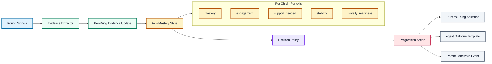
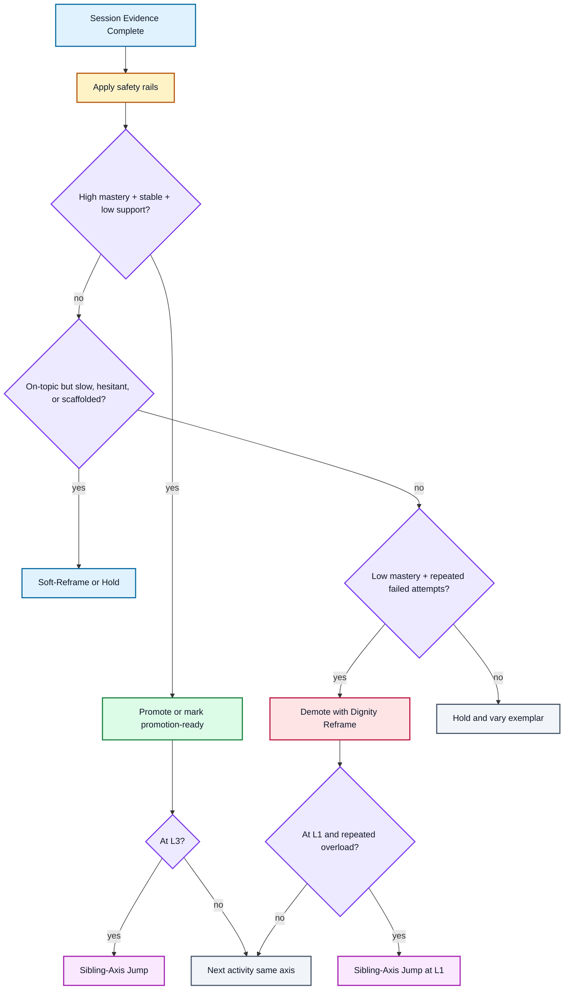
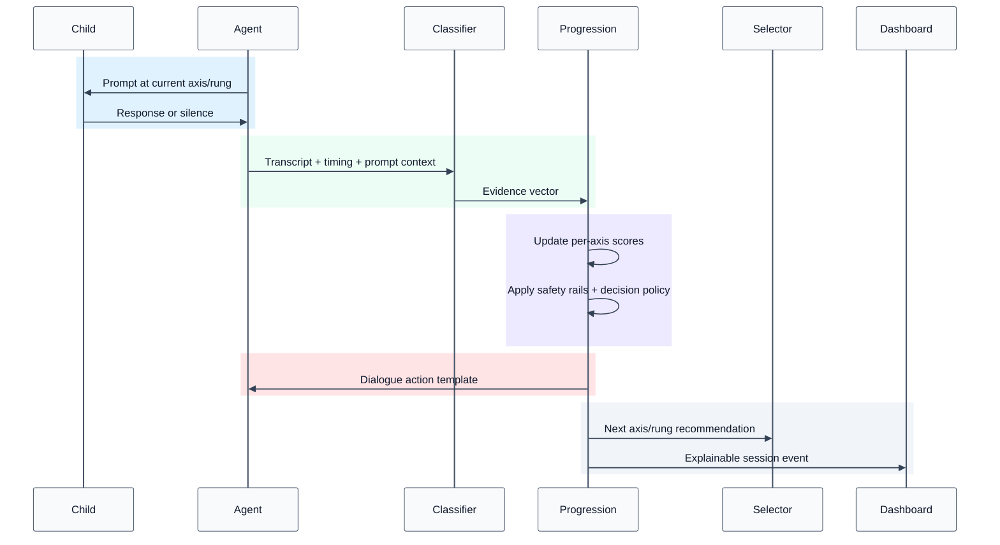

# Progression Algorithm Design — Evidence-Based Mastery With Rule Guardrails

**Date:** 2026-04-24  
**Status:** Draft for user review  
**Source specs reviewed:** `docs/plans/2026-04-23-progression-interaction-spec.md`, `docs/progression-pedagogy-spec.md`  
**Related authorities:** `docs/progression_axes.md`, `docs/plans/2026-04-21-progression-runtime-integration.md`, `docs/template_0_preview.html` §07

---

## 1. Purpose

The current progression system uses fixed rule thresholds to decide when to promote, hold, demote, soft-reframe, or sibling-jump. Those rules are clear and testable, but they compress a child's behavior into coarse counters: correct rounds, failed attempts, consecutive successes, and consecutive demotes.

This design keeps those rules as pedagogical safety rails, but moves the core decision logic to an **evidence-based mastery engine**. Each child response updates interpretable per-axis scores for mastery, engagement, support need, stability, and novelty readiness. The runtime then maps those scores to the same outward actions the product already understands.

The result is a better V1 algorithm that can ship before a trained model exists, while preserving a clean path to learned personalization later.

The external action enum remains unchanged: `promote`, `hold`, `soft_reframe`, `demote`, and `sibling_jump`. This design may use internal readiness flags such as `promote_ready`, but those flags are not new child-facing, parent-facing, or selector-facing actions.

---

## 2. Goals

- Preserve the existing product contract: seven independent progression axes, three cognitive rungs, and the same runtime actions.
- Distinguish high-confidence mastery from scaffolded correctness.
- Treat silence, hesitation, and support needs as nuanced evidence, not immediate failure.
- Keep demotion conservative and always protected by the Dignity Reframe.
- Keep the algorithm explainable to educators, PMs, engineers, and parent-facing analytics.
- Allow future learned weights or per-child pace models without changing the external runtime interface.

## 3. Non-Goals

- Do not replace the agent dialogue constraints in the interaction spec.
- Do not introduce a black-box model as the V1 decision authority.
- Do not collapse seven axes into one global child level.
- Do not add a second `progression.topic_axis` per activity.
- Do not surface demotion language to the child or parent.
- Do not require real training data before the improved algorithm can run.

---

## 4. Current Limitation

The fixed-threshold engine cannot distinguish cases that should lead to different pacing decisions.

| Case | Current rule risk | Better behavior |
|---|---|---|
| Two clean, fast answers with an unprompted reason | May promote, correctly | Promote or mark promotion-ready |
| Two correct answers after modeling and multiple choice | May promote too early | Hold with varied exemplars |
| Long silence after a correct response | May be misread as failed attempt unless guarded | Soft-Reframe; no mastery penalty |
| High engagement but low correctness | May demote too quickly | Scaffold and hold |
| Low engagement plus repeated off-topic responses | May look like ordinary failure | Demote only after safety checks; possibly sibling-jump |
| L3 mastery but low novelty | May repeat same axis too long | Sibling-jump or richer exemplar |

The fixed rules are still valuable as hard constraints, but they should not be the only intelligence in the engine.

### 4.1 Plain-language model: seven axes, three rungs

WonderLens does not treat a child as having one global level. It tracks seven separate ways of thinking. A child can be strong on one axis and new to another on the same day.

| Axis | Child-friendly meaning | Example at L1 | Example at L2 | Example at L3 |
|---|---|---|---|---|
| Form | What is it like? | "The ladybug is red." | "It has a red back, black spots, and tiny legs." | "The red warns birds not to eat it." |
| Function | How does it work? | "The car has wheels." | "The wheels help it roll." | "Without wheels, it could not move." |
| Causation | Why did that happen? | "The flower closed." | "It may open in the sun." | "It closes when there is no sunlight." |
| Change | How is it changing? | "The banana was green, then yellow." | "Next it turns brown." | "It ripens because it changes over time." |
| Connection | How is it connected? | "This shell is also round." | "These three things all have spiral shapes." | "Spiral shapes help some things grow or protect themselves." |
| Perspective | Who sees it differently? | "The dog is scared." | "The child thinks it is fun, but the dog thinks it is loud." | "They react differently because they need different things." |
| Responsibility | What should we do? | "The plant looks dry." | "We can give it water and move it to the sun." | "We should water it carefully because too much water can hurt it." |

Each axis has three rungs:

- **L1 Notice:** name or identify one thing.
- **L2 Extend:** add more parts, examples, steps, or viewpoints.
- **L3 Reason:** explain why, predict what-if, or state the rule behind the pattern.

### 4.2 How progression actions happen in practice

The runtime still emits a small set of actions. The evidence-based engine simply makes the choice more nuanced.

| Action | What the child experiences | Example |
|---|---|---|
| `promote` | The next prompt or activity asks for deeper thinking on the same axis. | On Form, a child easily names color and spots, then adds "red means don't eat me." Next time, the system can ask more L3 "why" questions. |
| `hold` | The child stays at the same rung, but gets a new exemplar or variation. | The child names two flower parts but needs time placing them. The system stays at Form L2 with another flower or leaf. |
| `soft_reframe` | The agent slows down, offers a hint, or asks a gentler version without changing rung. | After a correct answer, the child goes quiet for 8 seconds. The agent says, "Take your time. I am looking at the spots. What do you notice?" |
| `demote` | The system silently lowers cognitive load, while the agent models first. | At Causation L2, the child repeatedly goes off-topic. The agent says, "Let me show you what I notice first," and returns to describing what happened at L1. |
| `sibling_jump` | The next activity shifts laterally to a related axis for novelty or relief. | A child has mastered Form L3 on ladybugs, so the next activity jumps to Connection L1: "Can you find another tiny spotted thing?" |

The most important behavioral distinction is that **support does not equal failure**. A child who is engaged but needs hints should usually get `hold` or `soft_reframe`. A `demote` should require repeated, reliable evidence that the current rung is too demanding.

---

## 5. Recommended Approach

Use a hybrid algorithm:

1. Convert each round into an **evidence vector**.
2. Update per-child, per-axis, per-rung score state.
3. Apply hard pedagogical safety rails.
4. Use an explainable decision policy to choose an action.
5. Emit the same runtime action types already used by downstream systems.



---

## 6. Evidence Vector

Each round should emit more than a pass/fail label. The classifier can start heuristic and become LLM-assisted later.

| Field | Type | Meaning |
|---|---:|---|
| `correctness` | `0.0..1.0` | How well the response satisfies the current rung goal |
| `spontaneity` | `0.0..1.0` | Whether the child answered without heavy prompting |
| `latency_bucket` | enum | `fast`, `normal`, `long_wait`, `silence_after_correct`, `silence_no_attempt` |
| `hint_level` | enum | `none`, `light_hint`, `multiple_choice`, `modeling`, `caregiver_help` |
| `language_depth` | enum | `none`, `name`, `extend`, `reason`, `spontaneous_l_plus_1` |
| `on_topic_persistence` | `0.0..1.0` | Whether the child stayed with the activity despite imperfection |
| `prompt_repetition` | boolean | Whether the child repeated the prompt instead of answering |
| `off_topic` | boolean | Whether the response left the activity frame |
| `affect_energy` | optional enum | `engaged`, `hesitant`, `tired`, `frustrated`, `playful`, `unknown` |

V1 does not need all fields to be perfect. Missing or uncertain fields should default to neutral evidence, not negative evidence.

---

## 7. Evidence Reliability

Evidence detection will not be equally reliable across fields. The engine should explicitly tier evidence by source quality and confidence instead of treating every signal as fact.

| Reliability tier | Evidence fields | Source | V1 confidence | Policy use |
|---|---|---|---|---|
| Tier 1: hard telemetry | `latency_bucket`, prompt count, hint level emitted by runtime, silence duration, activity axis/rung | Runtime instrumentation | High | Safe to use directly |
| Tier 2: structured interaction facts | selected multiple-choice option, completed collection count, tapped target, repeated exact prompt text | UI/runtime events plus simple matching | High to medium | Safe with light validation |
| Tier 3: shallow language classification | correctness, off-topic, prompt repetition, language depth | Heuristic or LLM classifier | Medium | Use with confidence scores and reason codes |
| Tier 4: affect and energy | tired, frustrated, playful, hesitant | Voice/prosody, transcript cues, caregiver context | Low in V1 | Advisory only; never a sole promote/demote reason |

Each evidence vector should carry confidence values for classifier-derived fields:

```yaml
evidence:
  correctness: 0.72
  correctness_confidence: 0.61
  language_depth: reason
  language_depth_confidence: 0.58
  latency_bucket: normal
  latency_confidence: 1.0
  hint_level: light_hint
  hint_confidence: 1.0
```

Low-confidence evidence must be conservative:

- Low-confidence positive evidence can support `hold` or internal `promote_ready`, but should not by itself emit `promote`.
- Low-confidence negative evidence can increase `support_needed` slightly, but should not by itself emit `demote`.
- A `demote` requires at least one high-confidence behavioral signal, such as repeated silence/no-attempt, exact prompt repetition, repeated off-topic classification with confidence, or heavy runtime-recorded scaffolding.
- A `promote` requires either high-confidence task success telemetry or repeated medium-confidence language evidence across sessions.
- If evidence conflicts, prefer `hold` or `soft_reframe`.

This means V1 can be useful even if semantic classification is imperfect. The strongest early signals come from runtime-owned facts: wait time, hint count, prompt count, multiple-choice choices, activity completion, and whether the child needed modeling. The semantic classifier improves pacing quality, but the safety rails prevent it from becoming a single point of failure.

Recommended V1 detection strategy:

1. Start with Tier 1 and Tier 2 evidence as authoritative.
2. Add Tier 3 classifier outputs only when confidence is recorded and visible in explainability events.
3. Keep Tier 4 affect signals out of promotion/demotion decisions until validated.
4. Track disagreement between rule-only decisions and evidence-based decisions in shadow mode.
5. Audit false promote and false demote cases manually before widening classifier authority.

---

## 8. Axis State

State remains per child and per axis. Each axis tracks rung-specific mastery and shared behavioral scores.

```yaml
axis_state:
  axis: form
  current_rung: 2
  mastery:
    l1: 0.92
    l2: 0.71
    l3: 0.28
  engagement: 0.84
  support_needed: 0.31
  stability: 0.76
  novelty_readiness: 0.68
  recent_events:
    - hold
    - soft_reframe
    - promote_ready_internal
  policy_version: evidence_v1_default
```

Score meanings:

| Score | Meaning | High value implies |
|---|---|---|
| `mastery[rung]` | Evidence the child can handle a rung on this axis | Candidate for promotion or richer challenge |
| `engagement` | Evidence the child is participating and emotionally available | Keep working the axis |
| `support_needed` | Amount of scaffolding required | Hold, soften, or demote if persistent |
| `stability` | Consistency of recent evidence | More confidence in changing rung |
| `novelty_readiness` | Readiness for new exemplar, higher rung, or sibling axis | Rotate content or promote |

---

## 9. Score Update Policy

V1 uses hand-authored weights. These are intentionally simple, inspectable, and replaceable.

Example deltas:

| Evidence | Mastery | Engagement | Support needed | Novelty readiness |
|---|---:|---:|---:|---:|
| Clean correct, no hint | `+0.18` | `+0.06` | `-0.05` | `+0.08` |
| Spontaneous L+1 | `+0.20` current rung, `+0.10` next rung | `+0.08` | `-0.04` | `+0.30` |
| Correct after light hint | `+0.10` | `+0.04` | `+0.08` | `+0.02` |
| Correct after multiple choice | `+0.06` | `+0.03` | `+0.14` | `0.00` |
| Modeling needed | `+0.04` | `0.00` | `+0.20` | `-0.03` |
| Mixed but on-topic | `+0.04` | `+0.05` | `+0.08` | `0.00` |
| Off-topic | `-0.08` | `-0.12` | `+0.10` | `-0.04` |
| Repeats prompt | `-0.06` | `-0.04` | `+0.15` | `-0.03` |
| Long silence after correct | `0.00` | `-0.02` | `+0.10` | `0.00` |
| Silence no attempt | `-0.05` | `-0.10` | `+0.12` | `-0.04` |

Use bounded exponential smoothing:

```text
new_score = clamp(old_score * retention + evidence_delta, 0.0, 1.0)
```

Recommended V1 retention:

| Score | Retention |
|---|---:|
| `mastery` | `0.90` |
| `engagement` | `0.80` |
| `support_needed` | `0.85` |
| `novelty_readiness` | `0.75` |

`stability` is computed from recent score variance and outcome consistency rather than direct deltas.

---

## 10. Safety Rails

The existing pedagogy rules become hard constraints around the score policy.

| Existing rule | New role |
|---|---|
| 6-10 second wait time | Hard timing constraint before no-response interpretation |
| No demote after one silence | Hard demotion block |
| Soft-Reframe | Required action for processing-time or hesitant-but-engaged states |
| Dignity Reframe | Required dialogue surface for demote actions |
| Banned phrases | Unchanged agent-prompt constraint |
| Two failed attempts | Demotion eligibility threshold, not automatic demotion |
| Three same-axis successes | Promotion evidence, not automatic promotion |
| Sibling-axis jump | Preserved at L3 ceiling or persistent L1 overload |

Safety rails are evaluated before action selection. If a safety rail blocks an action, the policy must choose the nearest softer action, usually `hold` or `soft_reframe`.

---

## 11. Decision Policy

The decision policy maps state to one action. Thresholds should live in `progression_policy`.



Recommended starting thresholds:

| Action | Suggested condition |
|---|---|
| internal `promote_ready` | `mastery[current] >= 0.76`, `support_needed <= 0.35`, `stability >= 0.60` |
| `promote` | internal `promote_ready` plus either spontaneous L+1 or repeated strong evidence across sessions |
| `hold` | `mastery[current] 0.45..0.78`, or mixed evidence with adequate engagement |
| `soft_reframe` | high support need but adequate engagement, long silence after correctness, or hesitation with on-topic persistence |
| `demote_eligible` | repeated failed attempts plus `mastery[current] < 0.40` and `support_needed > 0.65` |
| `demote` | `demote_eligible` and no safety rail blocks demotion |
| `sibling_jump` | L3 ceiling with high novelty readiness, or L1 floor with persistent overload |

Promotion should be staged by default: first mark internal `promote_ready`, then emit `promote` when the next session confirms readiness or when the current session includes spontaneous L+1 evidence. This avoids overreacting to one lucky round.

---

## 12. Runtime Workflow



The classifier can be shallow in V1. The progression engine should not depend on a perfect classifier; it should treat uncertain evidence conservatively.

---

## 13. Explainability Event

Every decision should emit a compact explanation record.

```yaml
progression_event:
  axis: causation
  entry_rung: 2
  exit_rung: 2
  action: soft_reframe
  reason_codes:
    - long_silence_after_correct
    - adequate_engagement
    - demotion_blocked_single_silence
  evidence_confidence:
    correctness: 0.61
    language_depth: 0.58
    latency_bucket: 1.0
    hint_level: 1.0
  scores_before:
    mastery_current: 0.58
    engagement: 0.79
    support_needed: 0.37
  scores_after:
    mastery_current: 0.58
    engagement: 0.77
    support_needed: 0.46
  policy_version: evidence_v1_default
```

Reason codes are important. They make debugging possible and support parent-facing aggregation without exposing sensitive raw transcript details.

---

## 14. Migration From Current Rules

The improved engine can be introduced without breaking current consumers.

1. Keep the existing action enum.
2. Add evidence vector fields behind the current classifier output.
3. Add score state beside existing counters.
4. Run rule-only and evidence-based decisions in shadow mode.
5. Compare divergences against walkthrough scenarios and human review.
6. Promote evidence-based decisions to primary once divergences are understood.
7. Keep the rule engine available as strict fallback.

Shadow-mode divergence examples to inspect:

| Rule-only says | Evidence engine says | Likely interpretation |
|---|---|---|
| promote | hold | Correct but too scaffolded |
| demote | soft_reframe | Silence or hesitation, not inability |
| hold | internal `promote_ready` | Strong evidence but waiting for confirmation |
| hold | sibling_jump | Novelty-ready at ceiling or overloaded at floor |

---

## 15. Testing Strategy

Use deterministic fixtures first.

Required fixture families:

- Clean mastery: fast correct answers with no hints.
- Scaffolded correctness: correct only after multiple-choice or modeling.
- Reluctance not inability: silence after a correct answer.
- Hit wall: repeated off-topic or prompt repetition with low mastery.
- High engagement, low mastery: scaffold rather than demote.
- Spontaneous leap: L+1 reasoning when asked for L1/L2.
- Ceiling novelty: L3 mastery leading to sibling jump.
- Floor overload: repeated L1 overload leading to sibling jump.

Checks:

- Score updates are deterministic.
- Scores are clamped between `0.0` and `1.0`.
- Safety rails override score policy.
- Low-confidence classifier evidence cannot independently trigger promote or demote.
- Existing four progression walkthrough scenarios still produce compatible actions.
- Reason codes explain every action.
- No demotion occurs from a single silence.
- Dignity Reframe is attached to every demote.

---

## 16. Future Learned Personalization

The hand-authored V1 weights are not the final intelligence. They are an interpretable scaffold.

Once enough real sessions exist, the same interface can support:

- learned evidence weights by age tier;
- per-child pace calibration;
- axis-specific support thresholds;
- fatigue-aware session pacing;
- probability of success at candidate next rung;
- personalized novelty rotation across entities, pillars, and sibling axes.

The learned model should remain advisory unless it can produce calibrated confidence and reason codes. The safety rails remain non-negotiable.

---

## 17. Open Decisions for Implementation Planning

- Which repo owns the canonical policy config shape.
- Whether internal `promote_ready` is persisted or recomputed from recent evidence.
- Whether support need should decay faster between days than within a session.
- Whether caregiver help is a separate evidence dimension or a `hint_level`.
- How much transcript text, if any, is retained for audits versus converted immediately into reason codes.
- What confidence threshold each classifier-derived evidence field needs before it can affect promotion or demotion.

These are implementation planning decisions, not blockers for the algorithm design.

---

## 18. Design Summary

The progression engine should no longer ask only, "Did the child pass the threshold?" It should ask:

- How strong was the evidence?
- How much support did it require?
- Is the child engaged or overloaded?
- Is the pattern stable or noisy?
- Is the next best move deeper, lateral, softer, or simply different?

The recommended V1 is an evidence-based mastery engine with hard rule guardrails. It preserves the pedagogy and runtime contract already documented, but gives the system enough nuance to avoid premature promotion, punitive demotion, and repetitive holding.
