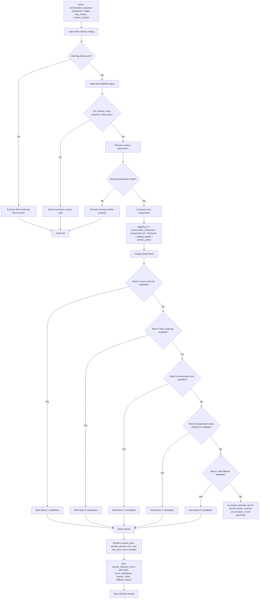

# Activity Selection Algorithm Design - Selector Only

**Date:** 2026-05-07
**Status:** Draft for user review
**Scope:** Runtime activity selector only
**Primary sources:** `docs/activity_tag_block_progression_guide.md`, `docs/activity_matcher_progression_workflows.md`, `docs/activity_tag_block_usage.md`, `activities/_schema/tag_block.schema.json`, `docs/superpowers/specs/2026-04-24-progression-algorithm-design.md`

---

## 1. Purpose

This design specifies the runtime activity selector that chooses one activity from the active catalog using the latest `tag_block.yaml` shape and the child's current progression status.

The selector is deliberately narrow. It consumes a precomputed `progression_target` from the progression service, but it does not update `axis_state`, classify mastery evidence, emit progression actions, or decide the next target axis/rung. Those responsibilities stay with the progression engine.

The selector answers one question:

> Given this photo, conversation, child tier, active catalog, progression target, and play history, which eligible activity should start now?

---

## 2. Goals

- Preserve hard eligibility rules from the current tag-block contract.
- Treat progression status as a strong preference, not a reservation.
- Prefer activities that naturally continue the child's current photo and conversation.
- Keep selection explainable through score breakdowns and reason codes.
- Support a small but growing catalog without requiring one bespoke activity per axis/rung/entity cell.
- Degrade gracefully when the preferred progression target is unavailable.

## 3. Non-Goals

- Do not update per-child progression state.
- Do not compute mastery, engagement, support need, stability, or novelty readiness.
- Do not ingest raw child-response evidence.
- Do not introduce new required tag-block fields.
- Do not expose score details, axis labels, or progression machinery to child-facing UI.
- Do not override safety, tier, property, or entity constraints to satisfy progression continuity.

---

## 4. Inputs And Outputs

### 4.1 Inputs

```yaml
conversation_signature:
  entity: pen
  entity_class: [pen, writing_tool, human_made_thing, observable_thing]
  detected_properties:
    color: red
    shape: long
    function: writing
  dominant_angle: color
  secondary_angles: [shape, function]
  child_tier: T1
  entity_role_implied: subject

progression_target:
  axis: form
  rung: 2
  target_type: same_axis
  reason_codes: [hold_same_axis, mastery_current_ready]

play_history:
  recent_activity_ids: [shape_quest_property]
  recent_family_keys: [shape_quest]
  recent_entities: [leaf]
  recent_pillars: [Discovery]
  recent_game_styles: [field_experiment]
  recent_observation_angles: [shape]

runtime_context:
  safety_status: safe
  movement_allowed: true
  available_activity_ids: [color_scout_property, shape_quest_property]
```

`progression_target` can be absent. When it is absent, the selector skips progression bonuses and ranks by eligibility, conversation coherence, freshness, catalog quality, and product policy.

### 4.2 Outputs

```yaml
activity_selection_event:
  selected_activity_id: color_scout_property
  selected_band: band_1_exact_continuity
  runtime_parameters:
    entity: pen
    matched_color: red
  rendered_preview:
    label: "Find three red things!"
    prompt: "You noticed the red of the pen. Let's go find more red things together."
    intro: "The child finds three red things using the photographed pen as a starting example."
  score_breakdown:
    eligibility_fit: 1.3
    conversation_coherence: 2.0
    progression_fit: 2.0
    freshness: 0.4
    catalog_quality: 0.8
    product_policy: 0.0
    total: 6.5
  reason_codes:
    - eligible_parameterized_property_match
    - dominant_angle_match
    - bridge_primary_overlap
    - exact_progression_target_match
    - fresh_activity_family
  fallback_reason: null
```

The selection event is for engineering, analytics, and tuning. Child and parent surfaces should receive natural activity-start copy and session summaries, not raw selector scores.

---

## 5. Algorithm Overview

Use a gated-band selector:

1. Load active activity packages.
2. Validate each `tag_block.yaml` against the schema.
3. Apply hard eligibility gates.
4. Resolve runtime parameters for eligible candidates.
5. Compute score components.
6. Assign each candidate to a priority band.
7. Rank candidates inside the highest non-empty viable band.
8. Render preview fields for the winner.
9. Emit a selection event with reason codes and score breakdown.

This combines explicit product priorities with tunable weights. Bands prevent progression targeting from overriding editorial coherence, while scores keep ranking flexible as the catalog grows.

### 5.1 End-To-End Selector Flow



---

## 6. Eligibility Gate

A candidate enters the eligible set only when all hard checks pass.

| Check | Fields used | Exclusion reason |
|---|---|---|
| Valid active package | `activity_id`, schema-required fields, catalog activation | `excluded_invalid_tag_block`, `excluded_inactive_activity` |
| Tier support | `tier_range.span`, `matchability.tier_support` | `excluded_tier_unsupported` |
| Binding fit | `entity`, `entity_class`, `entity_binding` | `excluded_binding_mismatch` |
| Class allowlist | `matchability.entity_class_filter` | `excluded_class_filter_mismatch` |
| Runtime property resolution | `activity_signature.observation_angle`, `activity_signature.focal_attribute` | `excluded_missing_runtime_property` |
| Safety and availability | runtime policy, setting, movement, device state | `excluded_safety_unavailable`, `excluded_runtime_unavailable` |

Progression cannot rescue an ineligible activity. If the target is `form/L2` but the only `form/L2` candidate requires a reliable color and the photo has no reliable color, that activity is excluded.

### 6.1 Binding Rules

| Binding | Eligible when |
|---|---|
| `bound` | The detected entity is the declared entity, or the detected class chain matches a safe authored family and the activity copy remains coherent. |
| `parameterized` | The entity can fill the required property/value slots, such as `{matched_color}` or `{matched_shape}`. |
| `agnostic` | The photo is safe and recognizable enough, and the activity does not secretly depend on a specific property or class. |

### 6.2 Parameter Resolution

The selector should resolve parameters before final scoring, because unresolved parameters often reveal hidden ineligibility.

Examples:

| Activity field | Runtime requirement |
|---|---|
| `observation_angle: color`, `focal_attribute: "{matched_color}"` | Detected or child-confirmed color. |
| `observation_angle: shape`, `focal_attribute: "{matched_shape}"` | Detected or child-confirmed shape. |
| `observation_angle: pattern`, `focal_attribute: "polka_dots"` | Detected pattern or class/context that safely supports the authored pattern. |
| `entity_role: subject` for bound activity | Runtime entity should remain the activity subject. |

When a value is not photo-verifiable but can be child-confirmed, the selector may keep the candidate only if the runtime can phrase the transition without claiming certainty.

---

## 7. Priority Bands

After eligibility, assign each candidate to exactly one band. The selector picks from the highest-priority non-empty band that clears minimum viability.

| Band | Meaning | Typical condition |
|---|---|---|
| `band_1_exact_continuity` | Best case: follows conversation and progression. | Exact target axis/rung plus strong conversation coherence. |
| `band_2_near_continuity` | Continues progression approximately. | Same axis with adjacent rung, elastic variant, or same-axis hold plus acceptable coherence. |
| `band_3_conversation_first` | Follows the child's current curiosity. | Strong conversation/photo coherence but off-target progression. |
| `band_4_progression_weak_coherence` | Progression match with weak editorial fit. | Target axis/rung match but weak conversation fit; use only when better coherent choices are absent. |
| `band_5_safe_fallback` | Last safe option. | Eligible fallback when no coherent or progression-fit candidate is viable. |

Recommended thresholds:

```text
strong_conversation_coherence >= 1.50
acceptable_conversation_coherence >= 0.75
exact_progression_fit >= 2.00
near_progression_fit >= 1.00
minimum_safe_total_score >= 2.50
```

These thresholds should live in selector policy config, not inline code.

### 7.1 Band Assignment Rules

1. If the candidate has exact progression fit and strong conversation coherence, assign `band_1_exact_continuity`.
2. Else if the candidate has near progression fit and acceptable conversation coherence, assign `band_2_near_continuity`.
3. Else if the candidate has strong conversation coherence, assign `band_3_conversation_first`.
4. Else if the candidate has exact or near progression fit and can be bridged without a jarring pivot, assign `band_4_progression_weak_coherence`.
5. Else assign `band_5_safe_fallback`.

The key policy is that `band_3_conversation_first` ranks above `band_4_progression_weak_coherence`. If the child photographs and talks about something that naturally supports a different activity, the selector should usually follow that moment rather than force the stored progression target.

---

## 8. Score Components

Within a band, sort by total score.

```text
score =
  eligibility_fit
+ conversation_coherence
+ progression_fit
+ freshness
+ catalog_quality
+ product_policy
```

### 8.1 Eligibility Fit, Up To 1.5

Eligibility fit distinguishes strong matches from barely eligible matches.

| Signal | Suggested effect |
|---|---:|
| Bound exact entity match | `+1.5` |
| Bound safe class-family match | `+1.1` |
| Parameterized property match with high confidence | `+1.3` |
| Parameterized property match with child-confirmed value needed | `+0.9` |
| Agnostic safe observable match | `+0.8` |
| Child tier equals `tier_range.primary` | `+0.2`, capped by component max |
| Child tier is in span but not primary | `0.0` |

### 8.2 Conversation Coherence, Up To 3.0

| Signal | Suggested effect |
|---|---:|
| `activity_signature.observation_angle` equals `dominant_angle` | `+1.5` |
| Observation angle appears in `secondary_angles` | `+0.75` |
| `bridge_prerequisites.primary` overlaps dominant or secondary angles | `+0.5` |
| Enum-valued `bridge_prerequisites.secondary` overlaps dominant or secondary angles | `+0.25` |
| `entity_role` matches `entity_role_implied` | `+0.25` |
| Entity role pivots and `role_pivot_note` exists | `0.0` |
| Entity role pivots and no `role_pivot_note` exists | `-0.75` |

Non-enum secondary descriptors may help human review, but they should not contribute structured scoring in V1.

### 8.3 Progression Fit, Up To 2.5

| Signal | Suggested effect |
|---|---:|
| Candidate `topic_axis` and `difficulty_level` exactly match target | `+2.0` |
| Same axis, adjacent rung | `+1.25` |
| Same derived activity family with an elastic rung variant | `+1.0` |
| Candidate matches recommended sibling axis | `+0.75` |
| Target absent | `0.0` |
| Candidate repeats an axis marked overloaded or saturated by progression target metadata | `-0.75` |

The current tag block does not define `activity_family`. V1 can derive a selector-only `family_key` from catalog metadata, package grouping, or an implementation-local mapping. This derived key should not be added to the tag block unless a later spec makes it a required field.

### 8.4 Freshness, From -2.0 To +1.0

| Signal | Suggested effect |
|---|---:|
| Exact `activity_id` repeated in recent window | `-2.0` |
| Same derived `family_key` repeated | `-1.0` |
| Same `game_style` repeated | `-0.4` |
| Same `pillar` repeated | `-0.25` |
| Same entity repeated without deepening intent | `-0.75` |
| Fresh mechanic or observation angle with strong coherence | `+0.3` |
| Fresh pillar while preserving coherence | `+0.2` |

Freshness should not force novelty at the cost of coherence. It is a tie-breaker and anti-repetition signal.

### 8.5 Catalog Quality, Up To 1.0

Catalog quality distinguishes complete, reviewed packages when several candidates are otherwise similar.

| Signal | Suggested effect |
|---|---:|
| Complete `prod.md`, `recap.template.yaml`, and `dashboard.template.yaml` | `+0.3` |
| Authored `intro`, `preview_label`, and `preview_prompt` render cleanly | `+0.3` |
| Role pivot has authored `role_pivot_note` when needed | `+0.2` |
| Known reviewed or gold status, if available in catalog metadata | `+0.2` |

Schema-required fields remain eligibility requirements. Catalog quality is for preferring stronger eligible packages, not validating the package.

### 8.6 Product Policy, From Hard Exclusion To +1.0

Hard policy failures are eligibility exclusions. Soft policy can adjust ranking.

Examples:

- Daily movement balance.
- Parent or educator preference.
- Low-energy mode.
- Indoor-only setting.
- Domain balance across math, science, language, and social-emotional tags.
- Business or curriculum priority for a reviewed seed package.

Policy adjustments must emit reason codes so tuning decisions remain auditable.

---

## 9. Tie-Breakers

If two candidates remain tied after total score:

1. Higher conversation coherence.
2. Higher progression fit.
3. Less recent activity family.
4. Less recent entity, pillar, or game style.
5. Higher catalog quality.
6. Stable alphabetical `activity_id`.

The final tie-breaker keeps selection deterministic.

---

## 10. Fallback Behavior

| Situation | Selector behavior | Event reason |
|---|---|---|
| No valid active catalog entries | Do not select; ask for another photo or continue conversation. | `no_active_valid_catalog` |
| No eligible candidates | Do not select; ask for another photo, continue conversation, or end gracefully. | `no_eligible_candidates` |
| Eligible candidates exist but none clear safe threshold | Use safe generic fallback only if available. | `no_coherent_candidate` |
| Progression target has no eligible candidate | Pick best coherent candidate. | `progression_unavailable_catalog_or_context` |
| Exact target absent but same-axis adjacent rung exists | Pick nearest coherent same-axis option. | `progression_nearest_rung` |
| Sibling target supplied at L3 ceiling or L1 overload | Prefer sibling only when conversation-coherent. | `sibling_target_followed` or `sibling_target_unavailable` |
| Child rejects preview | Rerank with rejection penalty on activity/family and prefer compatible bridge prerequisites. | `reranked_after_child_rejection` |

The selector should never imply that a progression target failed. If the child takes a new photo that supports a different coherent activity, the event should record that the selector followed the child's current context.

---

## 11. Rendering Rules

After selecting a winner, render these activity-signature fields:

- `activity_signature.preview_label`
- `activity_signature.preview_prompt`
- `activity_signature.intro`
- `activity_signature.role_pivot_note`, when a pivot needs surfacing

Runtime copy should not claim unverified facts. If the activity uses a value requiring child confirmation, the transition should be phrased as a question or observation rather than a certainty.

Examples:

| Risk | Safer rendering |
|---|---|
| Photo classifier guesses texture from image alone. | "It looks like it might be rough. Can you check with your eyes first?" |
| Color is reliable. | "You noticed the red of the pen." |
| Entity role pivots from subject to exemplar. | "The pen gave us our first red clue. Now let's find more red things." |

---

## 12. Explainability Reason Codes

Reason codes should cover both inclusion and exclusion.

### 12.1 Inclusion Codes

- `eligible_bound_exact_entity`
- `eligible_bound_class_family`
- `eligible_parameterized_property_match`
- `eligible_agnostic_safe_observable`
- `dominant_angle_match`
- `secondary_angle_match`
- `bridge_primary_overlap`
- `bridge_secondary_overlap`
- `entity_role_continuity`
- `entity_role_pivot_explained`
- `exact_progression_target_match`
- `nearest_progression_rung_match`
- `elastic_family_variant_used`
- `sibling_axis_match`
- `fresh_activity_family`
- `fresh_observation_angle`
- `soft_policy_bonus`

### 12.2 Exclusion And Fallback Codes

- `excluded_invalid_tag_block`
- `excluded_inactive_activity`
- `excluded_tier_unsupported`
- `excluded_binding_mismatch`
- `excluded_class_filter_mismatch`
- `excluded_missing_runtime_property`
- `excluded_safety_unavailable`
- `excluded_runtime_unavailable`
- `progression_unavailable_catalog_or_context`
- `progression_nearest_rung`
- `sibling_target_unavailable`
- `no_eligible_candidates`
- `no_coherent_candidate`
- `reranked_after_child_rejection`

Reason codes should be stable enough for dashboards and tests, but detailed enough to debug selector outcomes without reading raw transcripts.

---

## 13. Testing Strategy

Use deterministic fixtures before live tuning.

### 13.1 Required Fixtures

| Fixture | Expected behavior |
|---|---|
| Red pen, dominant angle color, target `form/L2` | Select `color_scout_property` over shape/pattern candidates. |
| Red pen, target `connection/L2`, no eligible connection activity | Select best coherent color activity and record progression unavailable. |
| Lion photo, behavior conversation, target `connection/L2` | Select `voice_stage_lion` if class and tier pass. |
| Butterfly photo, pattern conversation, target `connection/L2` | Select `mystery_trail_butterfly` over generic pattern activity if freshness permits. |
| Shape conversation after recent `shape_quest_property` replay | Penalize exact replay; choose next coherent non-repeated candidate if available. |
| Missing required property | Exclude parameterized property activity with `excluded_missing_runtime_property`. |
| Unsupported child tier | Exclude candidate before scoring. |
| Child rejects preview | Rerank with family rejection penalty and compatible bridge prerequisite preference. |

### 13.2 Checks

- Invalid tag blocks never score.
- Ineligible progression matches never win.
- `band_3_conversation_first` outranks `band_4_progression_weak_coherence`.
- Score totals equal component sums.
- Every winner has at least one inclusion reason code.
- Every excluded candidate has at least one exclusion reason code.
- Tie-breaking is deterministic.
- Rendered preview fields have all required parameters filled.
- Fallback events distinguish catalog gaps from safety/runtime gaps.

---

## 14. Rollout And Tuning

1. Implement selector event logging with the existing ranking behavior.
2. Run the gated-band selector in shadow mode against the same inputs.
3. Compare old winner versus new winner, band, and reason codes.
4. Manually review high-risk divergences:
   - old selector follows progression, new selector follows conversation;
   - old selector chooses a repeated activity, new selector rotates;
   - old selector finds no candidate, new selector finds a parameterized candidate.
5. Promote the new selector once fixture parity and reviewed divergences are acceptable.
6. Keep weights and thresholds in config so catalog growth can tune behavior without editing activity packages.

---

## 15. Open Implementation Decisions

- Exact play-history window length for activity, family, entity, pillar, style, and angle freshness.
- Whether `family_key` is derived entirely in code or maintained in a selector-local catalog index.
- Minimum viable score for `band_5_safe_fallback`.
- Whether product policy should run before band assignment, after scoring, or both.
- How much of the score breakdown is persisted permanently versus sampled for debug logs.
- Whether child rejection penalties last for one session, one day, or a shorter interaction window.

These decisions affect implementation planning, not the selector design boundary.

---

## 16. Summary

The selector should be a hard-gated, explainable ranking system. It first asks whether an activity can safely and coherently run for the current photo and child tier. It then prefers the progression target when the catalog and conversation support it. When progression continuity is unavailable or awkward, it follows the child's current curiosity and records why.

This design preserves the latest tag-block contract, respects the progression engine boundary, and gives engineering enough reason codes and score components to tune selection as the activity catalog grows.
